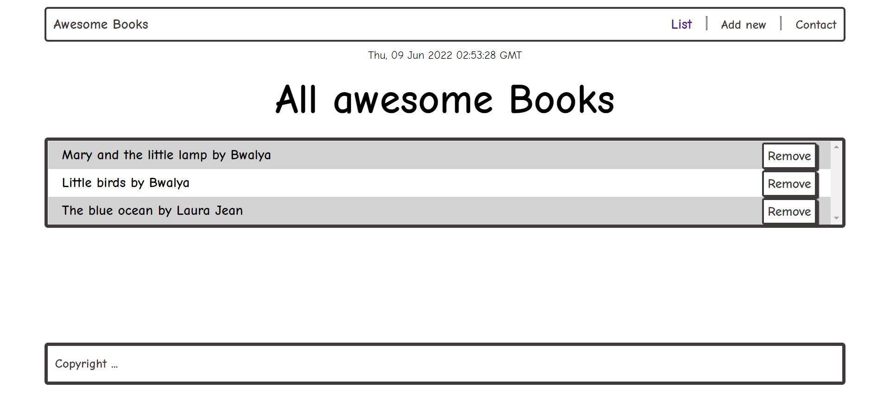

# Booklist-App

>  Booklist-App Project For Microverse By Bwalya Nonde.

> This is a simple web develoment project for microverse created using simple HTML(Hyper text mark-up   Language.) and CSS(Cascading Style Sheet) which is used for styling or decorating the webpage. And JavaScript which is used for making the webpage responsive.

## Built With

- html
- css
- javascript

## Getting Started
To get a local copy up and running follow these simple example steps.
git clone https://kirabo19.github.io/Booklist-App/ 
Main
cd Html-design 

## Author
👤 **Patrick Ndimukulaga*
👤 **Bwalya Nonde* 
👤 **Sajjad Rajaee* 

## 🤝 Contributing

Contributions, issues, and feature requests are welcome!

Feel free to check the [issues page](../../issues/).

## Show your support

Give a ⭐️ if you like this project!

## Acknowledgments

- Hat tip to anyone whose code was used
- Inspiration

## 📝 License

This project is [MIT](./MIT.md) licensed.